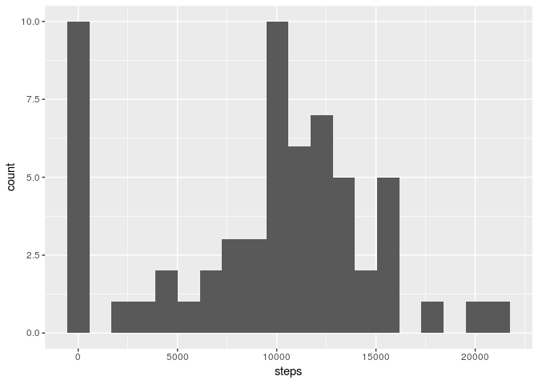
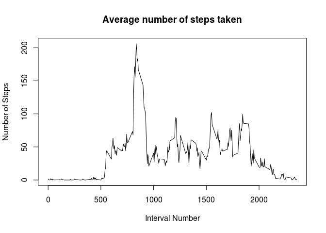
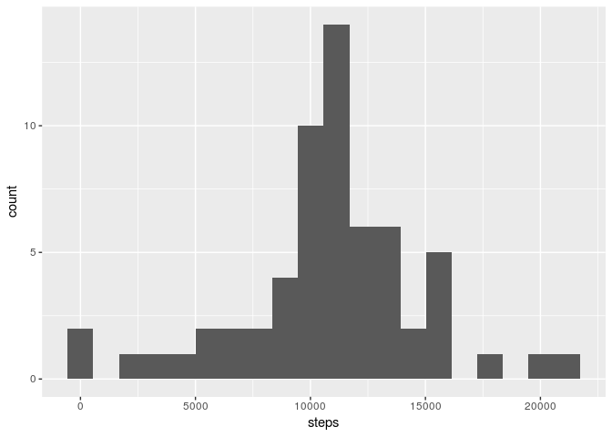
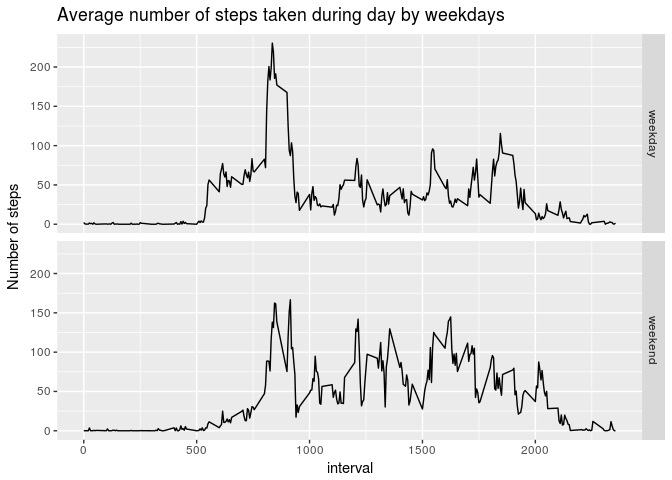

## Loading and preprocessing the data
The data is loaded from unzipped .csv file 

```r
activity <- read.csv("activity.csv", head = TRUE)
activity$date <- as.Date(activity$date)
```


## What is mean total number of steps taken per day?
Summarizing steps by each day

```r
library(dplyr)
library(ggplot2)
steps.n <- activity %>% group_by(date) %>% summarise(steps = sum(steps, na.rm = TRUE))
```

Histogram of the steps amount per day

```r
ggplot(steps.n, aes(steps))+geom_histogram(bins = 20)
```

<!-- -->

Mean value of steps per day

```r
mean(steps.n$steps, na.rm=TRUE)
```

```
## [1] 9354.23
```

Median value of steps per day

```r
median(steps.n$steps, na.rm=TRUE)
```

```
## [1] 10395
```

## What is the average daily activity pattern?

Summarizing steps per interval

```r
steps.interval <- activity %>% group_by(interval) %>% summarize(steps = mean(steps, na.rm = TRUE))
```

Time series plot, showing average number of steps taken per 5-minute interval, averaged across all days

```r
plot(x=steps.interval$interval, y=steps.interval$steps, type = "l", main = "Average number of steps taken", xlab = "Interval Number", ylab = "Number of Steps")
```

<!-- -->

Interval, containing maximum number of steps (on average across the days)

```r
steps.interval[which.max(steps.interval$steps),]$interval
```

```
## [1] 835
```

## Imputing missing values

Subsetting rows with NA values

```r
activity.na <- subset(activity, is.na(steps))
```

Number of rows with NA values

```r
dim(activity.na)[1]
```

```
## [1] 2304
```

Let's apply the follwing strategy in order to impute missing values
-take mean value for each 5-minute interval across all days
-assign all NA values with the mean value for corresponding interval

Generating dataset with imputed NA values

```r
imputedData <- activity.na
imputedData$steps <- vapply(X = imputedData$interval, FUN = function(x) { subset(steps.interval, interval == x)$steps}, FUN.VALUE = numeric(1))
activity.imputed <- activity
activity.imputed[is.na(activity$steps),] <- imputedData
```

Again grouping data per days

```r
steps.n2 <- activity.imputed %>% group_by(date) %>% summarise(steps = sum(steps, na.rm = TRUE))
```

Histogram of the steps amount per day

```r
ggplot(steps.n2, aes(steps))+geom_histogram(bins = 20)
```

<!-- -->

Mean value of steps per day

```r
mean(steps.n2$steps, na.rm=TRUE)
```

```
## [1] 10766.19
```

Median value of steps per day

```r
median(steps.n2$steps, na.rm=TRUE)
```

```
## [1] 10766.19
```

As we can see, the imputed data shifted some days with 0 steps to the right, and therefore mean and median shifted too.  
  
## Are there differences in activity patterns between weekdays and weekends?

Creating a new factor variable indicating whether a given date is a weekday or weekend day

```r
library(lubridate)
activity.imputed$weekday <- factor( (wday(activity.imputed$date) %in% c(1,7)))
levels(activity.imputed$weekday) <- c("weekday", "weekend")
```

Grouping data by intervals and weekdays

```r
steps.interval2 <- activity.imputed %>% group_by(interval, weekday) %>% summarize(steps = mean(steps, na.rm = TRUE))
```

Plot showing the average number of steps taken, averaged across all weekday days or weekend days 

```r
ggplot(steps.interval2, aes(interval, steps)) + geom_line() + facet_grid(weekday~.) + labs(y = "Number of steps", title = "Average number of steps taken during day by weekdays")
```

<!-- -->
